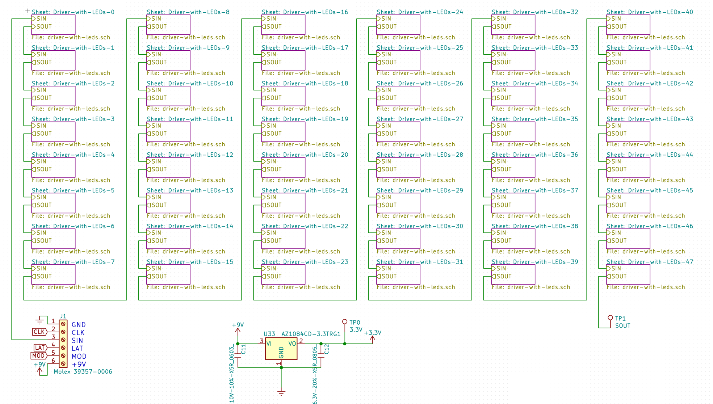
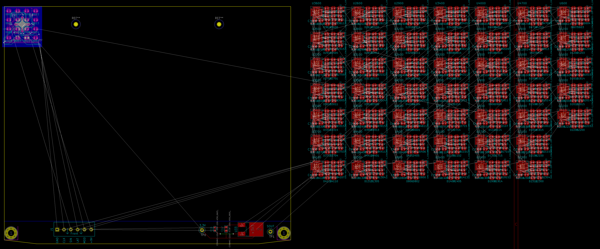
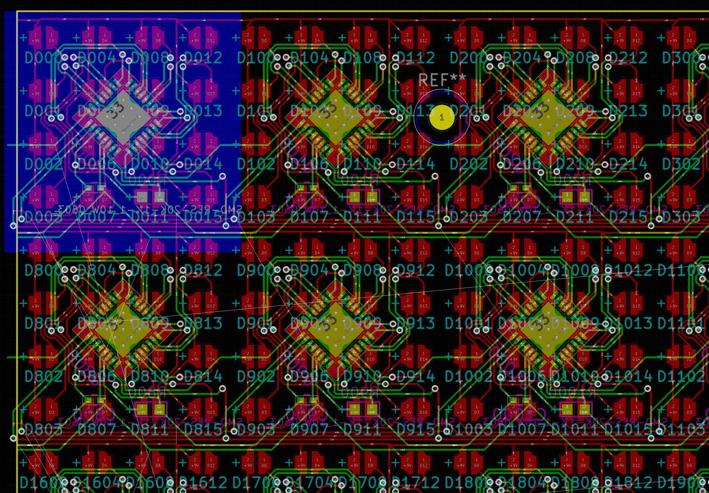
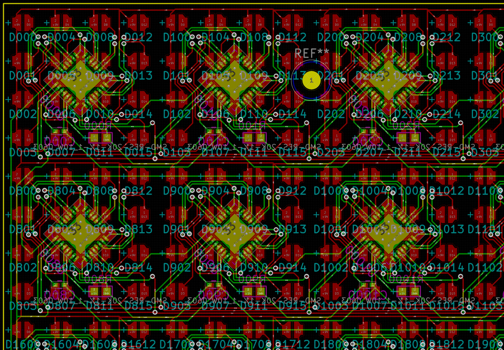

Clone part of a layout in Pcbnew.

## Usage

1. Organize the subschemas to be cloned in **hierarchical sheets**. Annotate them so that each sheet's components have reference ids starting with a different hundred.

2. Import netlist into Pcbnew. Place edge cuts. Place and route the components that will *not* be cloned. Also lay out the lowest-numbered subschema as a template. Surround it with a filled zone in Cmts.User layer.

3. Save the .kicad_pcb file. Edit our `layout_cloner.py` to match your circuit. Run it to produce a new .kicad_pcb file. Open the output file in Pcbnew. The ratsnest may be wrong; toggle it off and on to fix.

4. Clean up the edges of the patterned components. Try to keep this step as short as possible, because this work will be lost if/when you revisit Step 2.

## Running script on Windows

Your system Python probably doesn't have dependency `pcbnew`. Easiest to use KiCAD's Python instead.

In Pcbnew, go to Tools > Scripting Console, and run command:

    execfile(r'C:\REPLACE_WITH_PATH_TO_YOUR\layout_cloner.py')

If you have non-ASCII characters in your path, you need to double the backslashes and use this kludge:

    with open(u'C:\\RÉPLACE_WÍTH_PÁTH_TO_YǪÚR\\layout_cloner.py') as f: exec(f.read())

## Running script on Linux

TODO
